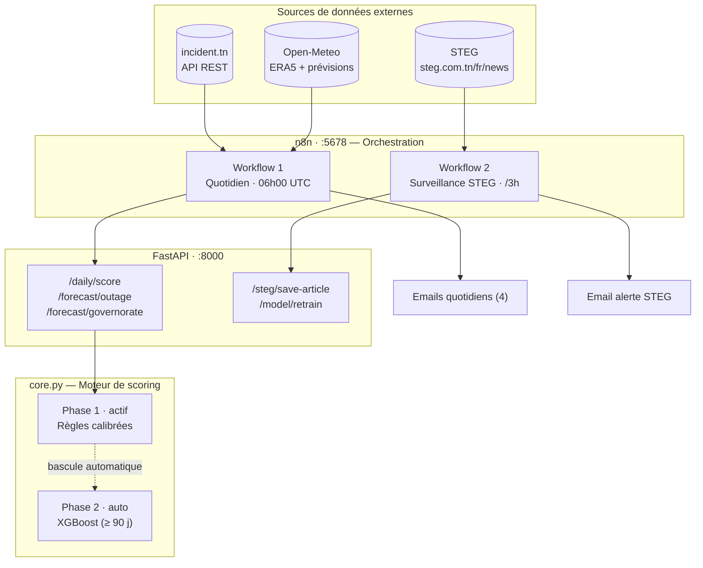
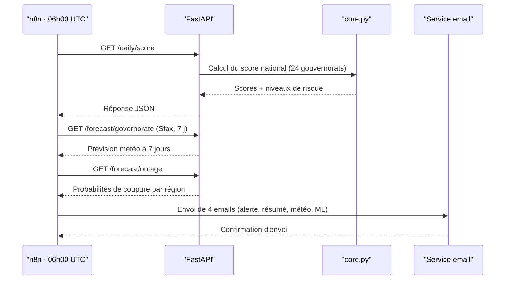
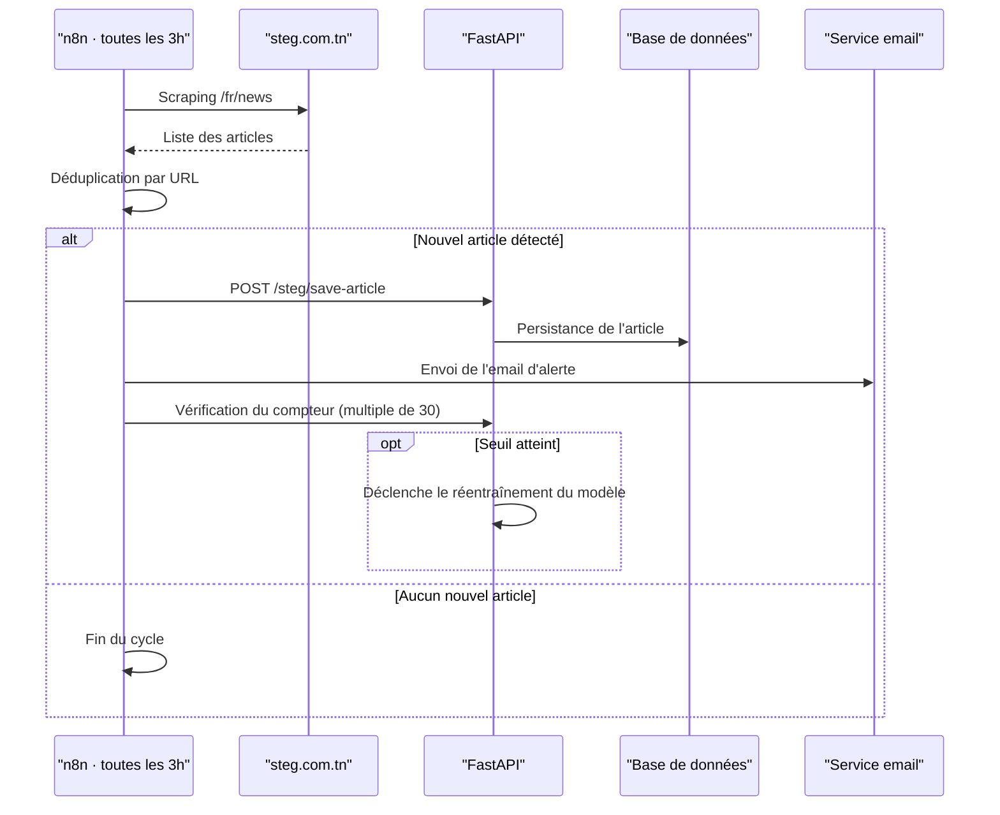
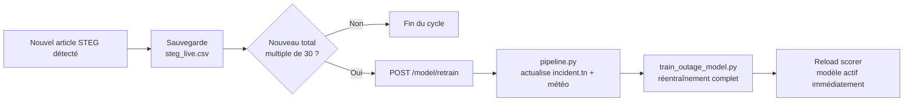

# OliveVolt ⚡ — Système de Prédiction des Coupures Électriques en Tunisie

**Voltage predictions powered by Olivesoft**

**Documentation technique**

| | |
|---|---|
| **Projet** | OliveVolt |
| **Développé par** | Équipe Olivesoft |
| **Contexte** | Hackathon Olive · Août 2026 |
| **Statut** | Prototype fonctionnel (Phase 1 active) |
| **Version** | 1.0 |

---

## Sommaire

1. [Résumé exécutif](#1-résumé-exécutif)
2. [Présentation de la solution](#2-présentation-de-la-solution)
3. [Architecture technique](#3-architecture-technique)
4. [Orchestration n8n — Workflows](#4-orchestration-n8n--workflows)
5. [Modèle de prédiction des coupures (XGBoost)](#5-modèle-de-prédiction-des-coupures-xgboost)
6. [Niveaux de risque](#6-niveaux-de-risque)
7. [Notifications par email](#7-notifications-par-email)
8. [Démarrage rapide](#8-démarrage-rapide)
9. [Glossaire](#9-glossaire)

---

## 1. Résumé exécutif

OliveVolt est un système automatisé qui anticipe les coupures d'électricité en Tunisie en croisant trois sources de données publiques : les avis officiels de la STEG, les signalements citoyens d'incident.tn et les données météorologiques d'Open-Meteo. Chaque matin à 06h00 UTC, il produit un score de risque pour les 24 gouvernorats et une prévision à 7 jours, puis diffuse les résultats par email. Une veille continue, toutes les 3 heures, détecte les nouveaux avis STEG et déclenche, tous les 30 articles, un réentraînement automatique du modèle.

**Points clés**

- **Autonomie complète** — orchestration de bout en bout par n8n, aucune intervention manuelle pour la collecte, le scoring ou l'envoi des alertes.
- **Deux sources sans clé API** (incident.tn, Open-Meteo), ce qui simplifie le déploiement et réduit les coûts d'exploitation.
- **Montée en puissance progressive** — un moteur à règles calibrées est actif dès le premier jour ; il cède la place à un modèle XGBoost dès que 90 jours de données réelles sont disponibles, sans redémarrage de service.
- **Boucle MLOps fermée** — la détection de nouveaux avis STEG déclenche elle-même le réentraînement, sans intervention humaine.
- **Jeu de données déjà constitué** — 113 événements STEG et 432 lignes météo/incidents couvrant les 24 gouvernorats.

---

## 2. Présentation de la solution

### 2.1 Objectif

Fournir aux autorités, opérateurs et citoyens une visibilité proactive sur le risque de coupure électrique, avant même la publication d'un avis officiel, en combinant signal météorologique (pics de demande liés à la chaleur), signal citoyen (incidents déjà en cours) et signal institutionnel (avis STEG).

### 2.2 Sources de données

| Source | Contenu | Mode d'accès | Fréquence |
|---|---|---|---|
| **STEG** (steg.com.tn/fr/news) | Avis officiels d'interruption par région | Scraping HTML | Toutes les 3h |
| **incident.tn** | Rapports citoyens de pannes par gouvernorat | API REST, sans clé | Quotidienne |
| **Open-Meteo** | Météo archive ERA5 + prévisions 7 jours | API REST, sans clé | Quotidienne |

---

## 3. Architecture technique

### 3.1 Vue d'ensemble



### 3.2 Composants

| Composant | Rôle | Port |
|---|---|---|
| **n8n** | Orchestration des workflows planifiés : scraping, scoring, envoi d'emails, réentraînement | 5678 |
| **FastAPI** (`api.py`) | Expose l'ensemble des endpoints de scoring, de prévision et de pilotage du modèle | 8000 |
| **core.py** | Configuration, features, calibration, scoring du risque, rendu HTML | — |
| **pipeline.py** | Téléchargement → fusion → calibration → évaluation (CLI) | — |
| **train_outage_model.py** | Entraînement XGBoost sur l'ensemble des données, prévision à 7 jours | — |

**Endpoints exposés par l'API**

| Méthode | Endpoint | Description |
|---|---|---|
| `GET` | `/health` | Vérification de disponibilité + phase du modèle actif |
| `GET` | `/model/info` | Seuils, pondérations, indicateur `ml_ready` |
| `POST` | `/predict` | Score de risque pour un couple (jour, gouvernorat) |
| `POST` | `/predict/batch` | Jusqu'à 200 observations en une seule requête |
| `POST` | `/report/national/json` | Rapport de risque HTML au format JSON (consommé par n8n pour les emails) |
| `GET` | `/daily/score` | Récupération + scoring en direct des 24 gouvernorats |
| `GET` | `/forecast/governorate` | Prévision de risque à 7 jours basée sur la météo, pour un gouvernorat (`?governorate=Sfax&days=7`) |
| `GET` | `/forecast/outage` | Prévision ML des coupures à 7 jours, toutes régions STEG (`?days=7`) |
| `GET` | `/forecast/outage/html` | Même contenu, au format HTML prêt pour l'email |
| `POST` | `/steg/save-article` | Enregistrement d'un nouvel avis STEG + vérification du seuil de réentraînement |
| `POST` | `/model/retrain` | Déclenchement du réentraînement complet (appelé automatiquement par n8n) |

### 3.3 Arborescence du projet

```
olivevolt/
├── core.py                     configuration, features, calibration, scoring du risque, rendu HTML
├── api.py                      FastAPI — tous les endpoints
├── pipeline.py                 téléchargement → fusion → calibration → évaluation (CLI)
├── train_outage_model.py       entraînement XGBoost sur toutes les données, prévision 7 jours
│
├── data/
│   ├── steg-outage-data/       avis de coupure STEG collectés (113 événements)
│   ├── raw/                    réponses JSON brutes des API
│   ├── processed/              merged_dataset.parquet / .csv
│   └── artifacts/              modèles + prévisions (voir §5.5)
│
├── n8n/
│   ├── workflow.json                pipeline quotidien de risque (4 emails)
│   └── steg_monitor_workflow.json   surveillance STEG /3h + réentraînement MLOps
│
├── docker/
│   ├── Dockerfile               image Python 3.11 multi-étapes
│   └── docker-compose.yml       risk-api + n8n
│
├── DOCUMENTATION_FR.md          documentation technique française (2 pages)
├── email_prediction_coupures.html   gabarit d'email HTML (aperçu statique)
└── requirements.txt
```

### 3.4 Déploiement

Le système est packagé en deux conteneurs Docker (`olivevolt-api` et `olivevolt-n8n`), démarrés conjointement via `docker compose up --build`.

---

## 4. Orchestration n8n — Workflows

### 4.1 Workflow 1 — Cycle quotidien (06h00 UTC)



Ce workflow enchaîne le calcul du score national, la prévision météo à 7 jours pour Sfax et la prévision ML des coupures, avant d'envoyer quatre emails distincts : alerte conditionnelle, résumé, prévision météo et prévision ML. Il est défini dans `n8n/workflow.json`.

### 4.2 Workflow 2 — Surveillance STEG (toutes les 3 heures)



La déduplication par URL garantit qu'un même avis STEG n'est jamais notifié deux fois. Chaque nouvel article est comptabilisé ; dès que ce compteur atteint un multiple de 30, le réentraînement du modèle est déclenché automatiquement (voir §5.4). Ce workflow est défini dans `n8n/steg_monitor_workflow.json`.

---

## 5. Modèle de prédiction des coupures (XGBoost)

### 5.1 Données d'entraînement fusionnées

| Source | Lignes | Période |
|---|---|---|
| STEG (scrape) | 113 événements | 18 juillet – 6 août 2026 |
| incident.tn | 432 lignes (24 gouvernorats) | 23 juillet – 9 août 2026 |
| Open-Meteo ERA5 | 432 lignes | 23 juillet – 9 août 2026 |

### 5.2 Variables explicatives (13 features)

| Catégorie | Variables |
|---|---|
| Calendrier | jour_semaine · mois · est_weekend |
| Météo | temp_max · temp_min · temp_moy · humidité_max · vent_max · précipitations |
| Incidents | rapports_national · rapports_région · coupure_hier · nb_coupures_3j |

### 5.3 Deux modèles complémentaires

| Modèle | Fichier | Sortie |
|---|---|---|
| Classificateur | `outage_clf.json` | Probabilité de coupure (0–1) |
| Régresseur | `outage_reg.json` | Heure de début prévue (0–23h) |

### 5.4 Cycle de vie MLOps



Séquence détaillée déclenchée à chaque nouvel avis STEG :

1. L'article est enregistré dans `data/steg-outage-data/data/processed/steg_live.csv`.
2. `/steg/save-article` renvoie `should_retrain: true` dès que le total de lignes franchit un multiple de 30.
3. n8n appelle automatiquement `POST /model/retrain`.
4. L'API relance `pipeline.py` puis `train_outage_model.py`, et recharge le scoreur en mémoire.
5. Le nouveau modèle sert immédiatement les requêtes suivantes — aucun redémarrage n'est nécessaire.

**Feuille de route du scoring**

| Phase | État | Méthode | Pondération |
|---|---|---|---|
| Phase 1 | **Active** | Règles calibrées | Température 30 % + Indice de chaleur 25 % + Rapports citoyens 30 % + Tendance 15 % → score 0–1 |
| Phase 2 | Activation automatique ≥ 90 jours de données réelles | XGBoost | Bascule sans redémarrage, mêmes endpoints API |

### 5.5 Artefacts du modèle (`data/artifacts/`)

| Fichier | Description |
|---|---|
| `outage_clf.json` | Classificateur XGBoost — probabilité de coupure par région et par jour |
| `outage_reg.json` | Régresseur XGBoost — heure de début prévue |
| `outage_model_meta.json` | Features, mapping des régions, statistiques d'entraînement, sources de données |
| `outage_forecast_7day.json` | Dernière prévision à 7 jours servie par `/forecast/outage` |
| `outage_forecast_7day.csv` | Même contenu au format CSV |
| `calibration.json` | Seuils du scoreur, calibrés sur les données réelles d'incident.tn |
| `evaluation_summary.json` | MAE de référence + corrélation du scoreur à règles |

**Pourquoi XGBoost au format JSON plutôt que joblib ?** Le format est portable entre versions de Python, lisible par un humain, et exempt du risque de sécurité associé à la sérialisation `pickle`.

---

## 6. Niveaux de risque

| Niveau | Score | Couleur |
|---|---|---|
| Low | 0,00 – 0,24 | 🟢 Vert |
| Moderate | 0,25 – 0,49 | 🟠 Orange |
| High | 0,50 – 0,74 | 🔴 Rouge |
| Extreme | 0,75 – 1,00 | 🟣 Violet |

La Phase 2 (scoreur XGBoost, §5.4) s'active automatiquement lorsque `calibration.json` indique `ml_ready: true`, c'est-à-dire dès que 90 jours réels de données incident.tn sont disponibles.

---

## 7. Notifications par email

Cinq types d'emails automatiques, tous rédigés en français :

| # | Déclencheur | Sujet type | Contenu |
|---|---|---|---|
| 1 | Quotidien 06h — si risque Élevé/Extrême | ⚡ ALERTE — Risque élevé de coupure — [date] | Tableau HTML des 24 gouvernorats, code couleur par niveau de risque |
| 2 | Quotidien 06h — systématique | 📊 Rapport du [date] — N région(s) à risque | Top 5 des gouvernorats à risque, statistiques nationales |
| 3 | Quotidien 06h — systématique | 🔮 Prévision Sfax 7 jours — pic : [niveau] le [date] | Tableau jour par jour : score, température, indice de chaleur |
| 4 | Quotidien 06h — systématique | 🔮 Prévision coupures ML 7 jours — [date] | Probabilités par région STEG, fenêtres horaires estimées |
| 5 | Toutes les 3h — si nouvel article | ⚡ STEG — N avis de coupure (dont N Sfax) — [date] | Titre et lien de chaque nouvel avis officiel |

Un aperçu statique du gabarit HTML utilisé pour ces emails est disponible dans `email_prediction_coupures.html`.

---

## 8. Démarrage rapide

```bash
# 1. Installation de l'environnement
python3 -m venv .venv && source .venv/bin/activate
pip install -r requirements.txt

# 2. Constitution des données + calibration des règles
python pipeline.py

# 3. Entraînement du modèle XGBoost + prévision 7 jours
python train_outage_model.py

# 4. Démarrage de l'API seule (développement)
uvicorn api:app --host 0.0.0.0 --port 8000
```

**Déploiement complet (API + n8n) :**

```bash
cd docker && docker compose up --build -d
```

Sortie attendue, confirmant que le réseau partagé et les deux conteneurs sont opérationnels :

```
✔ Network docker_default       Created
✔ Container olivevolt-api      Started                                    0.6s
✔ Container olivevolt-n8n      Started                                    0.4s
```

| Service | URL | Identifiants |
|---|---|---|
| API — documentation interactive | http://localhost:8000/docs | — |
| n8n — orchestrateur | http://localhost:5678 | `admin` / `changeme` |

Importer ensuite les deux workflows dans n8n : **Workflows → Import from file**, en sélectionnant successivement `n8n/workflow.json` et `n8n/steg_monitor_workflow.json`.

---

## 9. Glossaire

| Terme | Définition |
|---|---|
| **STEG** | Société Tunisienne de l'Électricité et du Gaz, opérateur national |
| **ERA5** | Réanalyse climatique de référence produite par le Copernicus Climate Change Service |
| **MLOps** | Pratiques d'automatisation du cycle de vie des modèles de machine learning : entraînement, déploiement, supervision, réentraînement |
| **Gouvernorat** | Division administrative de premier niveau en Tunisie (24 au total) |
| **XGBoost** | Bibliothèque de gradient boosting utilisée ici pour la classification et la régression |
| **ml_ready** | Indicateur booléen de `calibration.json` signalant que le volume de données réelles est suffisant pour activer la Phase 2 |

---

*Documentation technique — Hackathon Olive · Août 2026*
